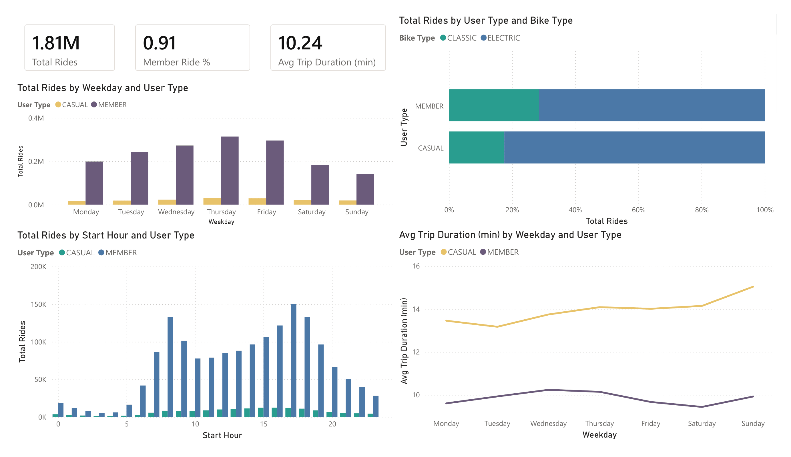
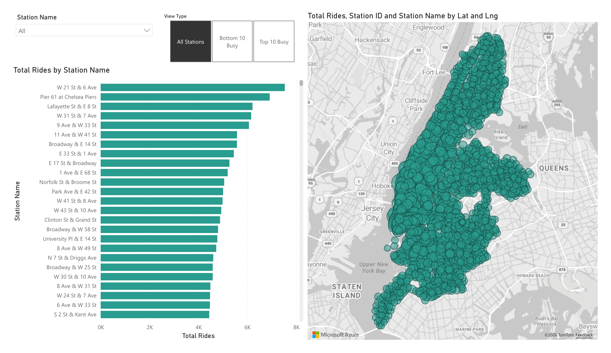
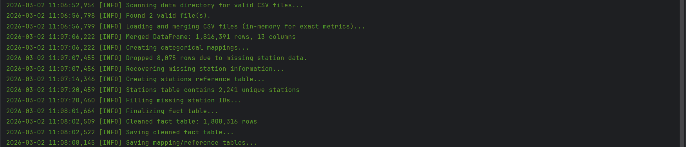
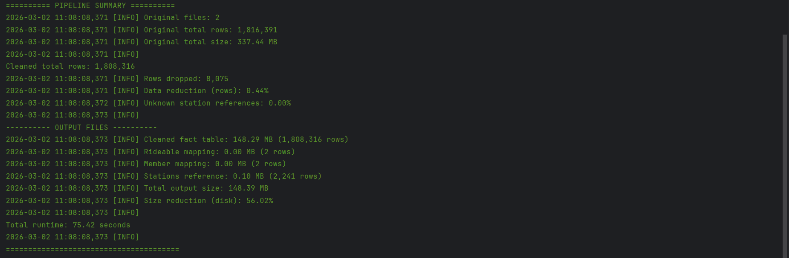

# Citi Bike Data Pipeline & Analytics Dashboard


An end-to-end data engineering pipeline that transforms raw NYC Citi Bike trip data into actionable insights via a PostgreSQL warehouse and Power BI.

**Pipeline Flow:** Raw CSV → Python ETL (Pandas) → PostgreSQL → Power BI

## Dashboard Preview & Insights

### Key Insights & Findings

The analysis of **1.8M+ trip records** reveals distinct behavioral patterns between subscriber types and provides clear markers for operational optimization.

| Category | Finding | Data Insight |
| :--- | :--- | :--- |
| **User Volume** | **Member Dominance** | Members accounted for **1,646,734** rides, representing the vast majority of system throughput. |
| **Ride Duration** | **Leisure vs. Utility** | Casual users ride **41% longer** (13.95 min) than Members (9.85 min), suggesting leisure vs. commute usage. |
| **Weekend Gap** | **Sunday Divergence** | The duration gap peaks on Sundays; Casual rides are **5.11 minutes longer** than Members on average. |
| **Station Demand** | **High-Traffic Hubs** | **W 21 St & 6 Ave** is the busiest hub (7,530 rides), handling **0.42%** of total system volume. |
| **Network Scale** | **Operational Range** | Analysis covered **2,204 unique stations**, ranging from high-density Manhattan hubs to low-volume outskirts. |

### Business Impact
* **Targeted Marketing:** Casual users account for **9.03%** of all trip minutes on Sundays, representing a prime segment for "Weekend Pass" or "Membership Trial" conversions.
* **Inventory Rebalancing:** The massive volume disparity (7,530 trips at the top station vs. 1 at the lowest) highlights a critical need for predictive bike rebalancing to prevent "dock-out" events at high-traffic hubs.
* **Data Integrity:** By filtering outliers (rides < 1 min or > 24 hours), the pipeline ensures that average trip durations are not skewed by system errors or unreturned bikes.






## Tech Stack
- Data Engineering: Python (Pandas) for cleaning/validation, Logging for pipeline tracking.
- Storage: PostgreSQL for relational modeling (Star Schema). 
- Analytics: SQL for complex aggregations, Power BI & DAX for visualization.

## Folder Structure
    citibike-portfolio/
    │
    ├─ scripts/              # Python ETL pipeline scripts
    │  ├─ main.py            # Runs the full ETL workflow
    │  ├─ cleaner.py         # Cleans and transforms raw CSV data
    │  └─ validate_csv.py    # Validates dataset structure and quality
    │
    ├─ sql/                  # SQL scripts to create/load tables
    │  ├─ schema.sql         # Creates database tables
    │  └─ load_data.sql      # Loads cleaned CSV data into tables
    │
    ├─ data/                 # Raw Citi Bike CSV datasets
    ├─ cleaned_output/       # Cleaned CSV outputs from ETL
    ├─ dax/                  # DAX measures for Power BI dashboards
    ├─ assets/               # Images of log and dashboard
    ├─ load_data.ps1         # DDL
    └─ README.md             # Project documentation

### Data Schema Compatibility
To ensure successful processing, the ETL pipeline enforces a strict **Data Contract**. The input CSV files must contain the following headers:

* **Identifiers:** `ride_id`, `rideable_type`
* **Timestamps:** `started_at`, `ended_at`
* **Station Info:** `start_station_name`, `start_station_id`, `end_station_name`, `end_station_id`
* **Coordinates:** `start_lat`, `start_lng`, `end_lat`, `end_lng`
* **User Type:** `member_casual`

> **Note:** This pipeline is designed for the modern standardized trip data format. Legacy datasets containing fields such as `tripduration`, `birth year`, or `gender` are **not compatible** with the current transformation logic.

## How to Run
1. **Prerequisites**
   - Python 3.x & PostgreSQL 12+ 
   - Data Source: Download from [Citi Bike System Data](https://s3.amazonaws.com/tripdata/index.html) and place `CSVs` in `/data.`

2. **Environment Setup**
    ```bash
   python -m venv venv
   source venv/bin/activate
   
   pip install -r requirements.txt
   ```

3. **Execute ETL Pipeline**
The pipeline handles data validation, schema mapping, and cleaning.
    ```bash
   python scripts/main.py
   ```

**Pipeline Screenshots**

**Pipeline execution log** – shows progress of file scanning, merging, mapping, and cleaning.  
     
**Pipeline summary metrics** – shows cleaned dataset stats, rows dropped, disk space reduction, and total runtime.  
     
 
4. Database Loading
Run the PowerShell script `load_data.ps1` to initialize the schema and dynamically load all split data files into PostgreSQL:

> Note: These scripts are **PostgreSQL-specific** and will not run directly on MySQL or SQL Server.

## Data License
This project utilizes public trip data provided by NYCBS under the [Citi Bike System Data](https://citibikenyc.com/system-data)  
   